[](https://GitHub.com/Naereen/StrapDown.js/graphs/commit-activity)
[](http://makeapullrequest.com)
[](https://github.com/sindresorhus/awesome)

# 🏄‍♂️ Awesome-Trajectory-Computing

Welcome to our carefully curated collection of **Deep Learning Methods and Foundation Models (LLM, LM, FM) for Trajectory Computing (Trajectory Data Management and Mining)** with awesome resources (paper, code, data, tool, etc.)! This repository serves as a valuable addition to our comprehensive survey paper. Rest assured, we are committed to consistently updating it to ensure it remains up-to-date and relevant.


By [Citymind LAB](https://citymind.top) , [HKUST(GZ)](https://www.hkust-gz.edu.cn/) .

Check out our comprehsensive tutorial paper:
> *Deep Learning for Trajectory Data Management and Mining: A Survey and Beyond.* <br/> Wei Chen, Yuxuan Liang†, Yuanshao Zhu, Yanchuan Chang, Kang Luo, Haomin Wen, Lei Li, Yanwei Yu, Qingsong Wen, Chao Chen, Kai Zheng, Yunjun Gao, Xiaofang Zhou, Fellow, IEEE, Yu Zheng, Fellow, IEEE. [[Link](#)]

> **<p align="justify"> Abstract:** *Trajectory computing is a pivotal domain encompassing trajectory data management and mining, garnering widespread attention due to its crucial role in various practical applications such as location services, urban traffic, and public safety. Traditional methods, focusing on simplistic spatio-temporal features, face challenges of complex calculations, limited scalability, and inadequate adaptability to real-world complexities. In this paper, we present a comprehensive review of the development and recent advances in deep learning for trajectory computing (DL4Traj). We first define trajectory data and provide a brief overview of widely-used deep learning models. Systematically, we explore deep learning applications in trajectory management (pre-processing, storage, analysis, and visualization) and mining (forecasting, recommendation, classification, estimation, anomaly detection, and generation). Additionally, we
summarize application scenarios, public datasets, and toolkits. Finally, we outline current challenges in DL4Traj research and propose future directions.* </p>

***We strongly encourage authors of relevant works to make a pull request and add their paper's information [[here](https://github.com/yoshall/Awesome-Trajectory-Computing/pulls)].***

👉 If you find any missed resources (paper / code / dataset / tool) or errors, please feel free to open an issue or make a pull request 🫡.

👉 Please consider giving this repository a star ⭐ if you find it helpful!


____

## 📰 News
```
- 2024.03.19: Successful launch of DL4Traj project! 😊
```

____

## 📚 Citation

👉 If you find our work useful in your research, please consider citing 👻:
```
@misc{chen2024deep,
      title={Deep Learning for Trajectory Data Management and Mining: A Survey and Beyond}, 
      author={Wei Chen, Yuxuan Liang†, Yuanshao Zhu, Yanchuan Chang, Kang Luo, Haomin Wen, Lei Li, Yanwei Yu, Qingsong Wen, Chao Chen, Kai Zheng, Yunjun Gao, Xiaofang Zhou, Yu Zheng},
      year={2024},
      archivePrefix={arXiv},
      primaryClass={cs.LG}
}
```

____

## 📇 Contents

- [Related Surveys](#related-surveys)
- [Taxonomy Framework](#taxonomy-framework)
    - [Trajectory Data Management Paper List](#deep-learning-for-trajectory-data-management)
    - [Trajectory Data Mining Paper List](#deep-learning-for-trajectory-data-mining)
- [Summary of Resources](#Taxonomy-and-summary-of-open-sourced-dataset)
    - [Datasets](#datasets)
    - [Tools](#tools)
    - [Other Useful Links](#other-useful-links)

____

## 📖 Related Surveys

- Trajectory data mining: an overview [[paper](#)]
- A survey on trajectory data mining: Techniques and applications [[paper](#)]
- Trajectory data mining: A review of methods and applications [[paper](#)]
- A survey on trajectory clustering analysis [[paper](#)]
- Trajectory data classification: A review [[paper](#)]
- A comprehensive survey on trajectory-based location prediction [[paper](#)]
- A survey on trajectory data management, analytics, and learning [[paper](#)]
- A survey on deep learning for human mobility [[paper](#)]
- Classifying spatial trajectories [[paper](#)]
- Traffic prediction using artificial intelligence: review of recent advances and emerging opportunities [[paper](#)]
- A benchmark of existing tools for outlier detection and cleaning in trajectories [[paper](#)]
- Spatio-temporal trajectory similarity measures: A comprehensive survey and quantitative study [[paper](#)]
- Trajectory similarity measurement: An efficiency perspective [[paper](#)]
- MobilityDL: A review of deep learning from trajectory data [[paper](#)]

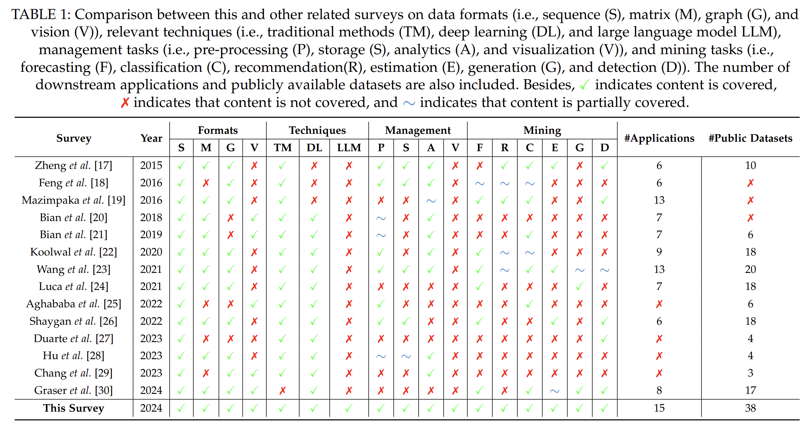

____

## 🖲️ Taxonomy Framework


**This survey is structured along follow dimensions:** 

* [Deep Learning for Trajectory Data Management](#deep-learning-for-trajectory-data-management)
    * [Pre-Processing](#pre-processing)
        * [Simplification](#simplification)
        * [Recovery](#recovery)
        * [Map-Matching](#map-matching)
    * [Storage](#storage)
        * [Storage Database](#storage)
        * [Index & Query](#index--query)
    * [Analytics](#analytics)
        * [Similarity Measurement](#similarity-measurement)
        * [Cluster Analysis](#cluster-analysis)
    * [Visualization](#visualization)
    * [Recent advances in LLMs for trajectory management](#recent-advances-in-llms-for-trajectory-management)
* [Deep Learning for Trajectory Data Mining](#deep-learning-for-trajectory-data-mining)
    * [Trajectory-related Forecasting](#trajectory-related-forecasting)
        * [Location Forecasting](#location-forecasting)
        * [Traffic Forecasting](#traffic-forecasting)
    * [Trajectory-related Recommendation](#trajectory-related-recommendation)
        * [Travel Recommendation](#travel-recommendation)
        * [Friend Recommendation](#friend-recommendation)
    * [Trajectory-related Classification](#trajectory-related-classification)
        * [Travel Mode Identification](#travel-mode-identification)
        * [Trajectory-User Linking](#trajectory-user-linking)
        * [Other Perspectives](#other-perspectives)
    * [Travel Time Estimation](#travel-time-estimation)
        * [Trajectory-based](#trajectory-based)
        * [Road-based](#road-based)
        * [Other Perspectives](#other-perspectives-1)
    * [Anomaly Detection](#anomaly-detection)
        * [Offline Detection](#offline-detection)
        * [Online Detection](#online-detection)
    * [Mobility Generation](#mobility-generation)
        * [Macro-dynamic](#macro-dynamic)
        * [Micro-dynamic](#micro-dynamic)
    * [Recent advances in LLMs for trajectory mining](#recent-advances-in-llms-for-trajectory-mining)

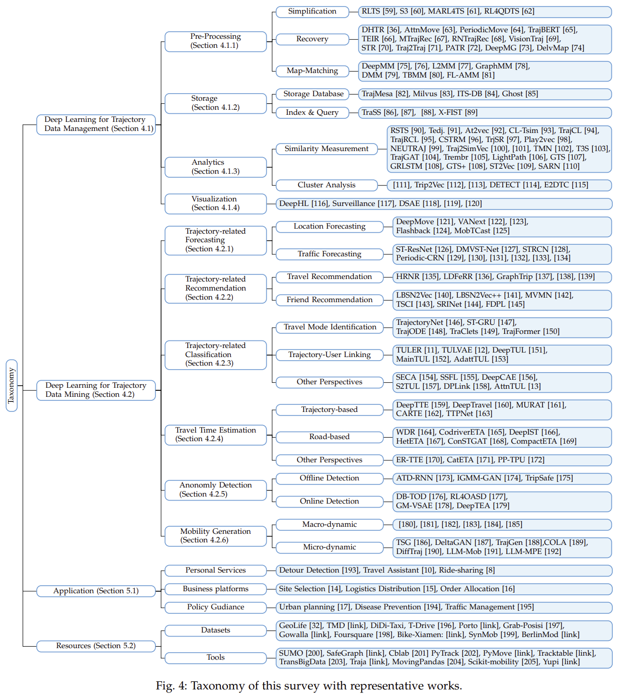

____

## <font color=SkyBlue>Deep Learning for Trajectory Data Management</font> 🔐


<details>
<summary>
<font size=4 color=Green>Pre-Processing</font>
</summary>

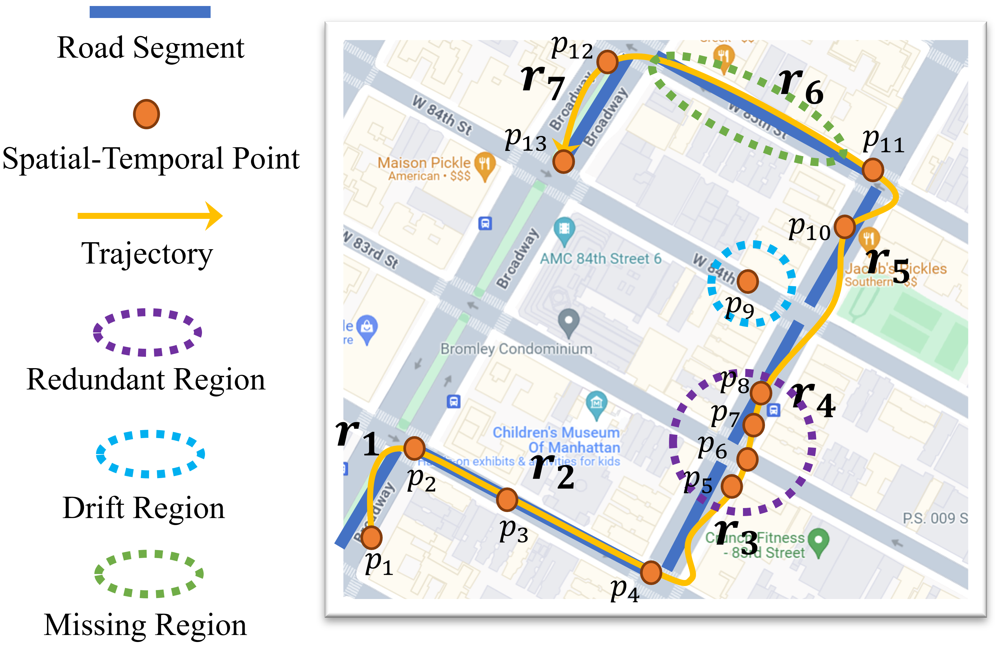

#### <font color=Orange>Simplification</font>

- Traditional Methods
    - Batch Mode
        - Algorithms for the Reduction of the Number of Points Required to Represent a Digitized Line or its Caricature
        - Direction-preserving  trajectory simplification
    - Online Mode
        - An online algorithm for segmenting time series
        - Spatiotemporal compression techniques for moving point objects
    - Semantic-based
        - Trace: Realtime compression of streaming trajectories in road networks
- Deep Learning Methods
    - Trajectory simplification with reinforcement learning
    - A Lightweight Framework for Fast Trajectory Simplification
    - Error-bounded Online Trajectory Simplification with Multi-agent Reinforcement Learning
    - Collectively simplifying trajectories in a database: A query accuracy driven approach


#### <font color=Orange>Recovery</font>

- Traditional Methods
    - Kinematic interpolation of movement data
    - A comparison of two methods to create tracks of moving objects: linear weighted distance and constrained random walk
    - Interpolation of animal tracking data in a fluid environment
- Deep Learning Methods
    - Free-space based
        - Deep trajectory recovery with fine-grained calibration using kalman filter
        - Attnmove: History enhanced trajectory recovery via attentional network
        - Periodicmove: shift-aware human mobility recovery with graph neural network
        - Trajbert: Bert-based trajectory recovery with spatial-temporal refinement for implicit sparse trajectories
        - Teri: An effective framework for trajectory recovery with irregular time intervals
    - Non Free-space based
        - Mtrajrec: Map-constrained trajectory recovery via seq2seq multitask learning
        - Rntrajrec: Road network enhanced trajectory recovery with spatial-temporal transformer
        - Visiontraj: A noise-robust trajectory recovery framework based on large-scale camera network
        - Learning semantic behavior for human mobility trajectory recovery
        - Traj2traj: A road network constrained spatiotemporal interpolation model for traffic trajectory restoration
        - Patr: Periodicity-aware trajectory recovery for express system via seq2seq model
    - Road Networks
        - Learning to generate maps from trajectories
        - Multimodal deep learning for robust road attribute detection
        - Aerial images meet crowdsourced trajectories: a new approach to robust road extraction
        - Deepdualmapper: A gated fusion network for automatic map extraction using aerial images and trajectories
        - Df-drunet: A decoder fusion model for automatic road extraction leveraging remote sensing images and GPS trajectory data
        - Delvmap: Completing residential roads in maps based on couriers’ trajectories and satellite imagery

#### <font color=Orange>Map-Matching</font>

- Traditional Methods
    - Road reduction filtering for GPS-gis navigation
    - A general map matching algorithm for transport telematics applications
    - Map-matching in complex urban road networks
    - Fast map matching, an algorithm integrating hidden markov model with precomputation
- Deep Learning Methods
    - Deepmm: Deep learning based map matching with data augmentation
    - Transformer-based mapmatching model with limited labeled data using transfer-learning approach
    - L2mm: learning to map matching with deep models for low-quality GPS trajectory data
    - Graphmm: Graph-based vehicular map matching by leveraging trajectory and road correlations
    - Dmm: Fast map matching for cellular data
    - Map-matching on wireless traffic sensor data with a sequence-to-sequence model
    - Fl-amm: Federated learning augmented map matching with heterogeneous cellular moving trajectories
</details>

____

<details>
<summary>
<font size=4 color=Green>Storage</font>
</summary>

#### <font color=Orange>Storage Database</font>

- Trajectory Management Systems
    - Sharkdb: An in-memory column-oriented trajectory storage
    - Elite: an elastic infrastructure for big spatiotemporal trajectories
    - Dragoon: a hybrid and efficient big trajectory management system for offline and online analytics
    - Trajmesa: A distributed nosql-based trajectory data management system
- Vector Databases
    - Vector-based trajectory storage and query for intelligent transport system
    - Ghost: A general framework for high-performance online similarity queries over distributed trajectory streams

##### <font color=Orange>Index & Query</font>

- Traditional index
    - Trajectory similarity join in spatial networks,
    - Distributed Trajectory Similarity Search
    - Distributed In-Memory Trajectory Similarity Search and Join on Road Network
    - Trass: Efficient trajectory similarity search based on key-value data stores
- Deep Learning Methods
    - Effectively Learning Spatial Indices
    - The Case for Learned Spatial Indexes
    - X-FIST: Extended Flood Index for Efficient Similarity Search in Massive Trajectory Dataset
</details>

____

<details>
<summary>
<font size=4 color=Green>Analytics</font>
</summary>

##### <font color=Orange>Similarity Measurement</font>

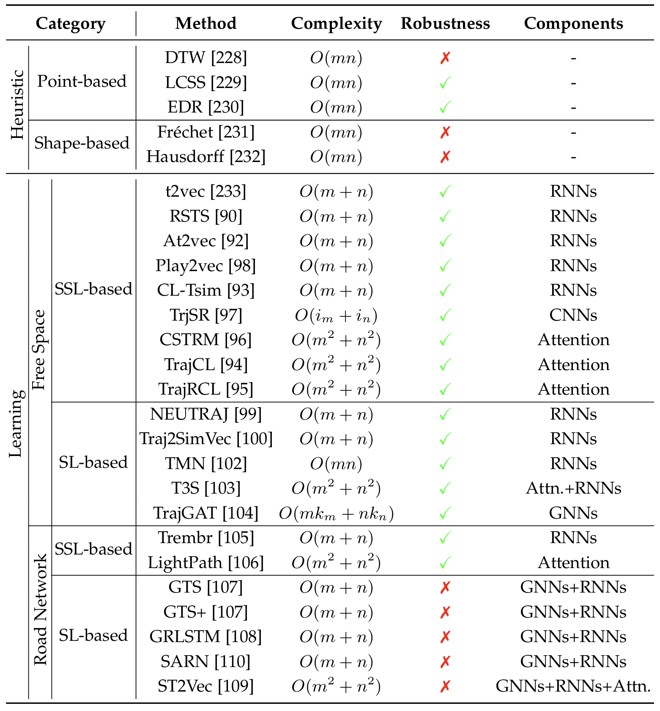

- Traditional Methods
    - Efficient retrieval of similar time sequences under time warping
    - Discovering Similar Multidimensional Trajectories
    - Robust and Fast Similarity Search for Moving Object Trajectories
    - Computing discrete fr ́ echet distance
    - The computational geometry of comparing shapes
- Deep Learning Methods
    - 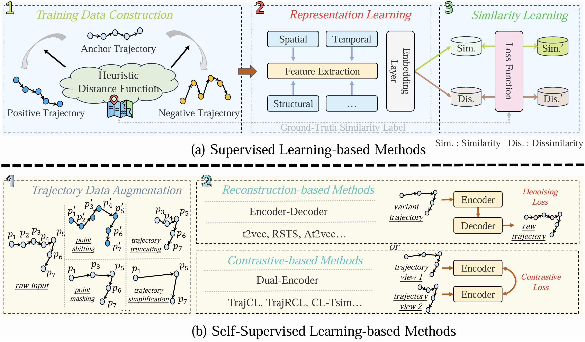
    - Free-Space
        - Supervised Learning-based
            - Computing Trajectory Similarity in Linear Time: A Generic Seed-guided Neural Netric learning approach
            - Trajectory Similarity Learning with Auxiliary Supervision and Optimal Matching
            - Embeddingbased Similarity Computation for Massive Vehicle Trajectory Data
            - TMN: Trajectory Matching Networks for Predicting Similarity
            - T3S: Effective Representation Learning for Trajectory Similarity Computation
            - TrajGAT: A Graph-based Long-term Dependency Modeling Approach for Trajectory Similarity Computation
        - Self-Supervised Learning-based
            - Deep Representation Learning for Trajectory Similarity Computation
            - Towards Robust Trajectory Similarity Computation: Representation-based Spatiotemporal Similarity Quantification
            - Similar Trajectory Search with Spatio-temporal Deep Representation Learning
            - Representation Learning with Multi-level Attention for Activity Trajectory Similarity Computation,
            - Efficient Trajectory Similarity Computation with Contrastive Learning
            - Trajectory Similarity Learning with Dual-Feature Attention
            - Self-supervised contrastive representation learning for large-scale trajectories
            - CSTRM: Contrastive Self-Supervised Trajectory Representation Model for Trajectory Similarity Computation
            - On Accurate Computation of Trajectory Similarity via Single Image Superresolution
            - Effective and Efficient Sports Play Retrieval with Deep Representation Learning
    - Road Network
        - Supervised Learning-based
            - A Graphbased Approach for Trajectory Similarity Computation in Spatial Networks
            - GRLSTM: Trajectory Similarity Computation with Graph-based Residual LSTM
            - Spatiotemporal Trajectory Similarity Learning in Road Networks
            - Spatial Structure-Aware Road Network Embedding via Graph Contrastive Learning
        - Self-Supervised Learning-based
            - Trembr: Exploring Road Networks for Trajectory Representation Learning
            - Lightpath: Lightweight and scalable path representation learning


##### <font color=Orange>Cluster Analysis</font>

- Traditional Methods
    - A review of moving object trajectory clustering algorithms
- Deep Learning Methods
    - 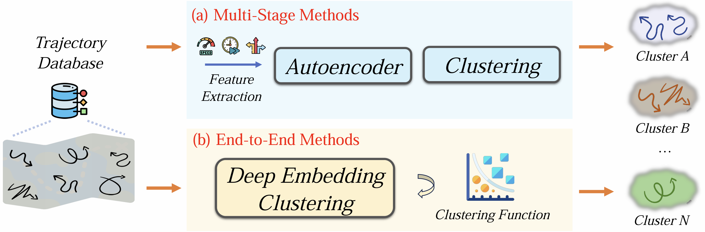
    - Multi-Stage 
        - Trajectory clustering via deep representation learning
        - Trip2vec: a deep embedding approach for clustering and profiling taxi trip purposes
    - End-to-End
        - Deep trajectory clustering with autoencoders
        - Detect: Deep trajectory clustering for mobility-behavior analysis
        - E2dtc: An end to end deep trajectory clustering framework via self-training

</details>

____

<details>
<summary>
<font size=4 color=Green>Visualization</font>
</summary>


- Traditional Methods
    - A descriptive framework for temporal data visualizations based on generalized space-time cubes
    - A survey of urban visual analytics: Advances and future directions
- Deep Learning Methods
    - Group Visualization
        - A visual analytics system for exploring, monitoring, and forecasting road traffic congestion
        - Visual abstraction of large scale geospatial origin-destination movement data
    - Individual Visualization
        - Deep learning-assisted comparative analysis of animal trajectories with deephl
        - Visualization of driving behavior based on hidden feature extraction by using deep learning
        - Deep learning detection of anomalous patterns from bus trajectories for traffic insight analysis

</details>

____

<details>
<summary>
<font size=4 color=Green>Recent advances in LLMs for trajectory management</font>
</summary>

- Recovery & Enhancement
    - Spatio-temporal storytelling? leveraging generative models for semantic trajectory analysis
    - An exploratory assessment of llm’s potential toward flight trajectory reconstruction analysis

</details>

____

### Deep Learning for Trajectory Data Mining 🔍

____

#### Trajectory-related Forecasting

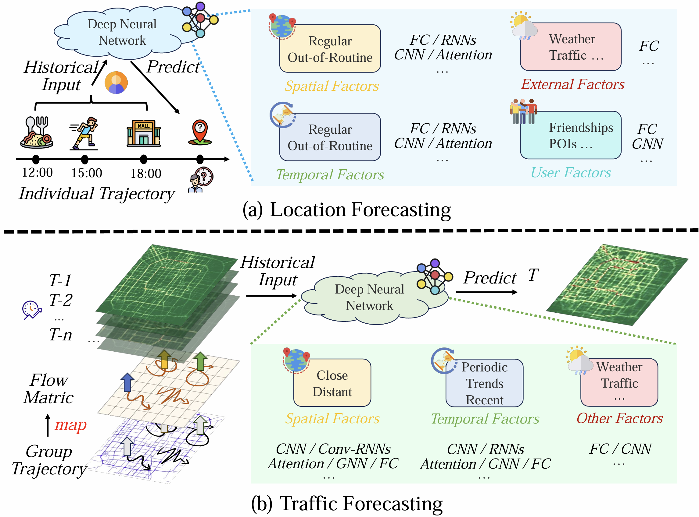

##### Location Forecasting

- Traditional Methods
    - 
    - 
- Deep Learning Methods
    - 
    - 
    - 
    - 
    - 
    - 
    - 

____

##### Traffic Forecasting

- Traditional Methods
    - 
    - 
- Deep Learning Methods
    - 
    - 
    - 
    - 
    - 
    - 
    - 

____

#### Trajectory-related Recommendation

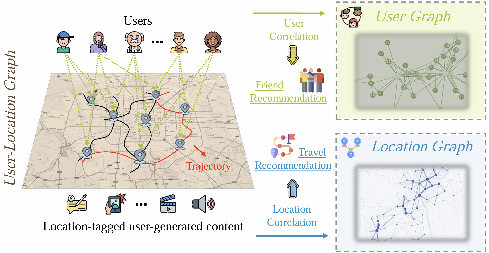

##### Travel Recommendation

- Traditional Methods
    - A survey of route recommendations: Methods, applications, and opportunities
- Deep Learning Methods
    - Hybrid Type
        - Learning effective road network representation with hierarchical graph neural networks
    - Sequential-based
        - Ldferr: A fuel-efficient route recommendation approach for long-distance driving based on historical trajectories
        - Progrpgan: Progressive gan for route planning
        - Personalized path recommendation with specified way-points based on trajectory representations
        - Personalized long distance fuel-efficient route recommendation through historical trajectories mining
        - Query2trip: Dual-debiased learning for neural trip recommendation
    - Graph-based
        - Dual-grained human mobility learning for location-aware trip recommendation with spatial–temporal graph knowledge fusion
        - Learning improvement heuristics for solving routing problems
        - Learning to effectively estimate the travel time for fastest route recommendation
    - Multi-modal Type
        - Walking down a different path: route recommendation based on visual and facility based diversity
        - Multi-modal transportation recommendation with unified route representation  learning
    - Reinforcement Learning
        - Spatio-temporal feature fusion for dynamic taxi route recommendation via deep reinforcement learning
        - Evacuation route recommendation using auto-encoder and markov decision process

____

##### Friend Recommendation

- Traditional Methods
    - Recommendations in location-based social networks: a survey
    - Where online friends meet: Social communities in location-based networks
    - Friend recommendation for location-based mobile social networks
    - Geo-friends recommendation in gps-based cyber-physical social network
- Deep Learning Methods
    - Revisiting user mobility and social relationships in lbsns: a hypergraph embedding approach
    - Lbsn2vec++: Heterogeneous hypergraph embedding for location-based social networks
    - Social link inference via multi view matching network from spatiotemporal trajectories
    - Trajectory-based social circle inference
    - Graph structure learning on user mobility data for social relationship inference
    - Friend recommendation in location based social networks via deep pairwise learning

____

#### Trajectory-related Classification

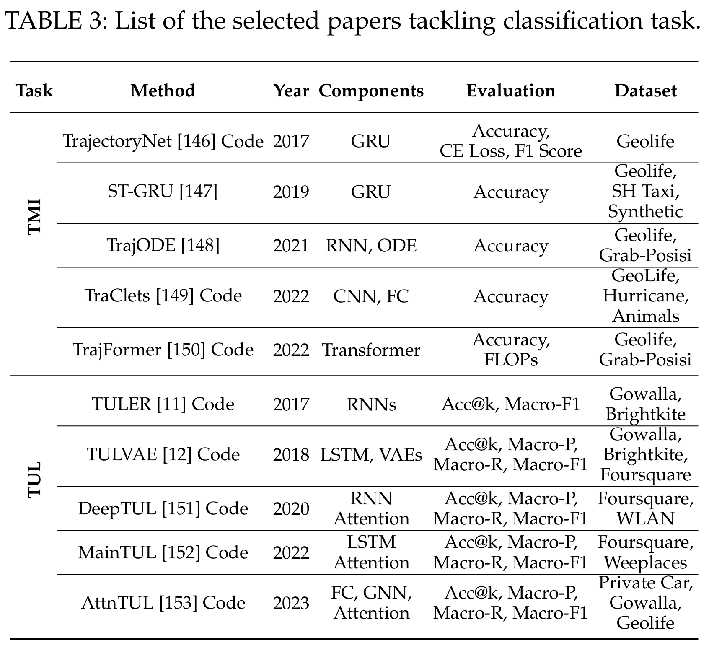

- Traditional Methods
    - A survey and comparison of trajectory classification methods
    - Traclass: trajectory classification using hierarchical region-based and trajectory-based clustering
    - Integrating cross-scale analysis in the spatial and temporal domains for classification of behavioral movement
    - Learning transportation mode from raw gps data for geographic applications on the web
    - Revealing the physics of movement: Comparing the similarity of movement characteristics of different types of moving objects

##### Travel Mode Identification

- Deep Learning Methods
    - Estimator: An effective and scalable framework for transportation mode classification over trajectories
    - Trajectorynet: An embedded gps trajectory representation for point-based classification using recurrent neural networks
    - Spatio-temporal gru for trajectory classification
    - Modeling trajectories with neural ordinary differential equations
    - Traclets: Harnessing the power of computer vision for trajectory classification
    - Trajformer: Efficient trajectory classification with transformers
    - Semi-supervised deep learning approach for transportation mode identification using gps trajectory data
    - Distributional and spatial-temporal robust representation learning for transportation activity recognition
    - End-to-end trajectory transportation mode classification using bi-lstm recurrent neural network
    - Trajectory-as-a-sequence: A novel travel mode identification framework
    - A multi-scale attributes attention model for transport mode identification
    - Graph based embedding learning of trajectory data for transportation mode recognition by fusing sequence and dependency relations


____

##### Trajectory-User Linking

- Deep Learning Methods
    - Identifying human mobility via trajectory embeddings
    - Trajectory-user linking via variational autoencoder
    - Trajectory-user linking with attentive recurrent network
    - Mutual distillation learning network for trajectory-user linking
    - Adversarial mobility learning for human trajectory classification
    - Self-supervised human mobility learning for next location prediction and trajectory classification

____

##### Other Perspectives

- Deep Learning Methods
    - Semi-Supervised Learning
        - Semi-supervised deep learning approach for transportation mode identification using gps trajectory data
        - Semi-supervised deep ensemble learning for travel mode identification
        - Semi-supervised federated learning for travel mode identification from gps trajectories
    - Unsupervised Learning
        - Unsupervised deep learning for gps based transportation mode identification
    - Limited Data Scenario
        - Improving transportation mode identification with limited gps trajectories
        - A framework of travel mode identification fusing deep learning and map-matching algorithm
    - Unlabeled Data Scenario
        - S2tul: A semisupervised framework for trajectory-user linking
    - Cross-Platform Scenarios
        - Dplink: User identity linkage via deep neural network from heterogeneous mobility data
        - Egomuil: Enhancing spatio-temporal user identity linkage in location-based social networks with ego-mo hypergraph
    - Different Data Type Scenarios
        - Trajectory-user linking via hierarchical spatio-temporal attention networks

____

#### Travel Time Estimation

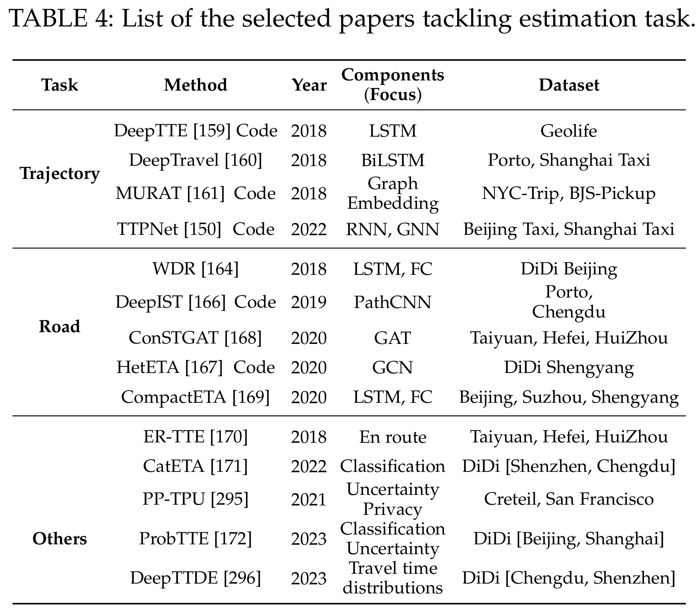

##### Traditional Methods
- 
    - Historical data based real time prediction of vehicle arrival time
    - A simple baseline for travel time estimation using large-scale trip data
    - HTTP: A new framework for bus travel time prediction based on historical trajectories
    - Route travel time estimation using low-frequency floating car data


##### Deep Learning Methods 

- Trajectory-based
    - When will you arrive? estimating travel time based on deep neural networks
    - Traffic speed prediction and congestion source exploration: A deep learning method
    - Deeptravel: a neural network based travel time estimation model with auxiliary supervision
    - Multi-task representation learning for travel time estimation,
    - Context-aware road travel time estimation by coupled tensor decomposition based on trajectory data
    - MTLM: a multi-task learning model for travel time estimation
    - TTPNet: A neural network for travel time prediction based on tensor decomposition and graph embedding
    

- Road-based
    - Learning to estimate the travel time
    - CoDriver ETA: Combine driver information in estimated time of arrival by
    driving style learning auxiliary task
    - DeepIST: Deep image-based spatiotemporal network for travel time estimation
    - HetETA: Heterogeneous information network embedding for estimating time of arrival
    - ConstGAT: Contextual spatial-temporal graph attention network for travel time estimation at baidu maps
    - CompactETA: A fast inference system for travel time prediction
    - Road network metric learning for estimated time of arrival
    - Interpreting trajectories from multiple views: A hierarchical selfattention network for estimating the time of arrival
    - Dual graph convolution architecture search for travel time estimation
    - Route travel time estimation on a road network revisited: Heterogeneity, proximity, periodicity and dynamicity
    


- Other Perspectives
    - CatETA: A categorical approximate approach for estimating time of arrival
    - Uncertainty-aware probabilistic travel time prediction for on-demand ride-hailing at didi
    - SSML: Self-supervised meta-learner for en route travel time estimation at baidu maps
    - Privacy-preserving travel time prediction with uncertainty using GPS trace data
    - Citywide estimation of travel time distributions with bayesian deep graph learning
    - MetaER-TTE: An Adaptive Meta-learning Model for En Route Travel Time Estimation
    - Cross-area travel time uncertainty estimation from trajectory data: a federated learning approach
    - Travel time distribution estimation by learning representations over temporal attributed graphs
    
____

#### Anomaly Detection

##### Offline Detection

- Traditional Methods
    - 
    - 
- Deep Learning Methods
    - 
    - 
    - 
    - 
    - 
    - 
    - 

____

##### Online Detection

- Traditional Methods
    - 
    - 
- Deep Learning Methods
    - 
    - 
    - 
    - 
    - 
    - 
    - 

____

#### Mobility Generation

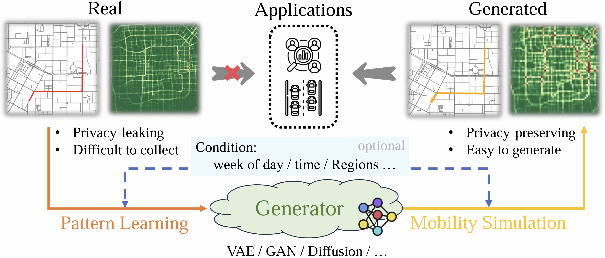

##### Macro-dynamic

- Traditional Methods
    - 
    - 
- Deep Learning Methods
    - 
    - 
    - 
    - 
    - 
    - 
    - 

____

##### Micro-dynamic

- Traditional Methods
    - 
    - 
- Deep Learning Methods
    - 
    - 
    - 
    - 
    - 
    - 
    - 

____

#### Recent advances in LLMs for trajectory mining

- Forecasting
    - Where would i go next? large language models as human mobility predictors
    - Exploring large language models for human mobility prediction under public events
    - Prompt mining for language-based human mobility forecasting
    - Urbangpt: Spatio-temporal large language models
- Generation
    - Large language models as urban residents: An llm agent framework for personal mobility generation
    - Mobilitygpt: Enhanced human mobility modeling with a gpt model
- Identification
    - Are you being tracked? discover the power of zero-shot trajectory tracing with llms!

____

## Summary of Resources 🛠️

____

### Datasets

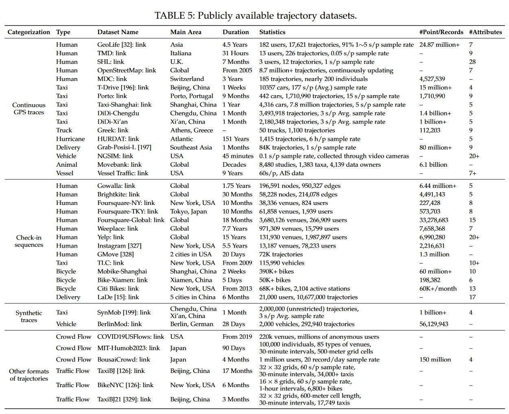

____

### Tools

- [SUMO](https://eclipse.dev/sumo)
- [SafeGraph](https://docs.safegraph.com/docs/welcome)
- [Cblab](https://github.com/caradryanl/CityBrainLab)
- [PyTrack](https://github.com/titoghose/PyTrack)
- [PyMove](https://pymove.readthedocs.io/en/latest)
- [TransBigData](https://transbigdata.readthedocs.io/)
- [Traja](https://github.com/traja-team/traja)
- [MovingPandas](https://github.com/movingpandas/movingpandas)
- [Scikit-mobility](https://github.com/scikit-mobility/scikit-mobility)
- [Tracktable](https://github.com/sandialabs/tracktable)
- [Yupi](https://github.com/yupidevs/yupi)

____


### Other Useful Links

- [Uber](https://www.uber.com)
- [DiDi](https://didiglobal.com)
- [Google Map](https://www.google.com/maps)
- [Baidu Map](https://map.baidu.com)
- [Cainiao](https://www.cainiao.com)

____


## Star History

[](https://star-history.com/#yoshall/Awesome-Trajectory-Computing&Date)
